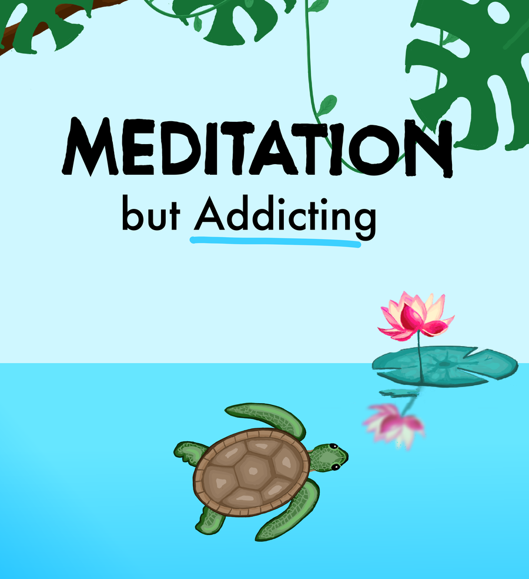

<p align="center">
  
</p>

# Shellevate

A meditation app that works like a game. You meditate, you keep a streak going, and every so often a session drops an egg that hatches into a turtle for your collection.

It has been on the App Store since September 2022: [Shellevate - Meditation Game](https://apps.apple.com/us/app/shellevate-meditation-game/id1645214014).

<p align="center">
  
  
  
  
</p>

## How it works

Meditating on consecutive days builds a streak. Miss a day and a streak freeze covers it, if you have one.

Finishing a session can drop an egg. The first session always does. After that it's 10% for a short sit, 12.5% from ten minutes, and 40% past thirty. The odds live in a file called `eggquation.dart`.

Eggs hatch into one of 26 turtles across five rarities. A few only turn up under certain conditions: the Luna Turtle needs the Night soundscape, the Lightning Turtle needs a thunderstorm, the Dino Turtle lives in the Prehistoric Sea, and the Litback Turtle won't appear until you've added a friend.

There are 14 soundscapes and six breathing exercises (box breathing, 4-7-8 and so on), a stats page with a heatmap of the days you sat, levels, gems and a shop to spend them in.

Friends can follow each other, show up on a shared leaderboard, and send a high-five or a poke, which arrives as a push notification.

The Shallows is a small scene built with Flame where the turtles you've hatched swim around with the fish and lilypads.

## What's in the repo

| Folder | What it is |
| --- | --- |
| `meditate_app/` | The Flutter app for iOS and Android, about 28k lines of Dart. GetX for state, Flame for the Shallows, Firebase Messaging for push, RevenueCat for the subscription, PostHog for analytics. |
| `backend/` | Express and TypeScript API on MongoDB. Accounts, friends, usage stats, reminder pushes and password reset. Deployed on Google App Engine. |
| `website/` | A small React page for looking at usage stats. |
| `*.kra`, `*.png` | Krita sources and exports for the posters, stickers and ads. |

## Running it

The app talks to the production API by default, so this is enough to try it:

```sh
cd meditate_app
flutter pub get
flutter run
```

To run the backend yourself:

```sh
cd backend
npm install
cp .env.example .env   # then fill in the values
npm run dev
```

It also needs a Firebase service account key at `backend/src/firebase/firebase.json`, which is not in the repo. To point the app at your local server, set `TESTING = true` in `meditate_app/lib/api/index.dart`.

The stats page:

```sh
cd website
npm install
npm start
```
